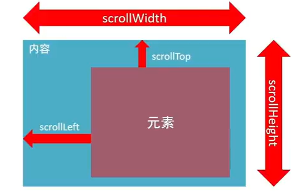

# 常用方法

```js
// 去除空格
字符串.trim()
//字符串拼接
利用map()和join()数组方法实现字符串的拼接
map()可以遍历数组处理数据，并"返回新的数组"
const newArr=arr.map(fucntion(ele,index){
	ele//数组元素
	index//数组索引号
	return ele+"颜色"
})
join()方法用于把所有元素转化成一个字符串，小括号为空为默认","分割，小括号为空字符串join(''),则数组直接连接到一起
```


# const和let

```js
const存储的是地址，所以当const定义Array，object时，可以改变里面的值
```

# API

```
可以通过js去操作html浏览器
分类:DOM(文档对象模型)，BOM(浏览器对象模型)

```

# 随机函数

```js
随机一个从N，到M的数字
function random(N,M){
	return Math.floor(Math.random()*(M-N+1))+N
}
```


# DOM

## DOM树

```
将html文档以树状结构直观的表现出来
```

DOM对象

```
所有的标签属性都可以在这个对象上面找到
修改这个对象的属性会自动映射到标签身上
```

## 获取DOM元素

```js
1.根据css选择器
document.querySelector('css选择器')
获取匹配的第一个元素
可以直接修改

document.querySelectorAll("css选择器")
获取所有元素，得到一个伪数组，有长度，有索引号的数组，但没有pop(),push()等数组的方法
不可以直接修改，需要通过遍历的方式进行修改

//获取body
document.body
//获取html标签
document.documentElement

其它方法
//根据id获取一个元素
document.getElementById('nav')
//根据标签获取一类元素，获取页面所有div
document.getElementsByTagName('div')
//根据类名获取元素，获取页面所有类名为w的
document.getElementsByClassName('w')
```

## 操作元素内容

```js
对象.innerText.属性
	获取标签中文字内容，也可以进行修改
对象.innerHTML
	
```

## 操作元素属性

```js
操作元素常用"属性"
对象.属性=值


```

## 操作元素样式

```js
"方法一"
操作元素常用"样式"
元素.style.样式属性=""
特殊样式没有"-",而是换成了驼峰写法，首字母大写，如
background-color----->backgroundColor
body不用获取--->document.body.style.样式属性

"方法二"
通过添加类名，添加元素的类名，做到通过css改变样式
元素.className="类名1 类名2 ..."
可以添加多个类名，用空格隔开，"会覆盖之前的类名"

"方法三"
//追加一个类
元素.classList.add("类名")
//删除一个类
元素.classList.remove("类名")
//切换一个类(有这个类就删掉，没有就加上)
元素.classList.toggle("类名")

//看有没有包含某个类如果有，返回true，没有返回false
classList.contains()

```

## 操作表单里面的属性

```js
//获取表单内容
对象.value
//设置表单的值
对象.value=""

//表单属性中添加就有效果，移除就没效果，一律使用布尔值表示，如果为true代表添加了该睡醒，如果为false代表移除了该属性
如:checked,
	
```

## 自定义属性

```js
必须以data开头
对象.dataset	集合，获取以data开头的属性集合
```

# 定时器-间歇函数 	

```js
"开启"
setInterval(函数,间隔时间<单位是毫秒>)
通常用let n=setInterval(函数,间隔时间<单位是毫秒>),来创建这样可以可以利于暂停
函数部分，函数不能加"()",匿名函数直接写里面
"关闭"
clearInterval(变量<定义的开启时的变量>)
            
```

# 事件监听

```js
//就是让程序检测是否有事件产生，一旦有事件触发，就立即调用一个函数做出响应，也称为绑定事件或者注册事件，比如鼠标经过下拉菜单，比如点击轮播图
"语法"
元素对象.addEventListener('事件类型',要执行的函数,true<添加true表明添加事件捕获的过程>)
"事件监听三要素"
1.事件源:哪个dom元素被事件触发了，要获取dom元素
2.事件类型:用什么方式触发，比如说鼠标单击click、鼠标经过mouseover等
3.事件调用函数:要做什么事
4.利用js的方法自动调用事件	事件名.世界类型
```

## 事件监听版本

```js
DOM L0
事件源.on事件=function(){}
DOM L2
事件源.addEventListener(事件,事件处理函数)
区别:
on方式会被覆盖，addEventListener方式可绑定多次，拥有事件更多特性
```

# 事件类型

```js
"鼠标事件"
click	鼠标点击
//没有冒泡效果
mouseenter	鼠标经过
mouseleave	鼠标离开
//有冒泡效果
mouseover	鼠标经过
mouseleave	鼠标离开
"焦点事件"
表单获得光标
focus	获得焦点
blur	失去焦点
"键盘事件"
Keydown	键盘按下触发
Keyup	键盘抬起触发
"文本事件"
input	用户输入事件
"表单事件"
change	当表单中的内容改变后事件才会触发
```

# 事件对象

```js
也是对象，这个对象里有事件触发时的相关信息
例如:鼠标点击事件中，事件对象存了

语法："如何获取"
	在事件绑定的回调函数的第一个参数就是事件对象
	一般命名为event、ev、e
    元素. addEventListenter("click",function(e){})

//部分常用属性
type
	获取当前的事件类型
clientX/clientY
	获取光标相对于浏览器可见窗口左上角的位置
offsetX/offsetY
	获取光标相对于当前DOM元素左上角的位置
key
	用户按下的键盘键的值
    现在不提倡使用keyCode
```

# 环境对象

```js
指的时函数内部特殊的变量this，它代表着当前函数运行时所处的环境
作用:弄清楚this的指向，可以让我们代码更简洁
谁调用函数this指向谁，普通函数里面this指向window
```

# 回调函数

```js
如果将函数A做为参数传递给函数B时，我们称函数A为回调函数
列如:
function fn(){
    cosole.log("")
}
setInterval(fn,1000)
```

# 事件流

```js
事件流指的是事件完整过程中流动路径
//捕获阶段
从大的范围到小的范围
//冒泡
从小的阶段到大的阶段
//阻止冒泡/传播
事件对象.stopPropagation()
```

# 解绑事件

```js
"方法一"
对象.事件=null
列如	btn.onclick=null
"方法二"
对象.removeEventListener('click',函数)
```

# 事件委托

```js
通过给父元素的绑定，因为点击子元素时会出现冒泡效果
事件对象.target	表示点击子元素中的某一个
e.li.style.color=''	表示ul中点击某个li会改变它的值
事件对象.target.tagName可以获得真正触发事件的元素
例如:
<script>
        const ul = document.querySelector('ul')
        ul.addEventListener('click', function (e) {
            //'LI'一定要大写
            if (e.target.tagName === 'LI') {
                e.target.style.color = 'red'
            }
        })
</script>
```

# 阻止默认行为

```js
对象.addEventListener('submit',function(e){
    //阻止默认行为，如链接跳转，表单提交
	e.preventDefault()
})
```

# 其它事件

## 页面加载事件

```js
//window是最大的事件，当整个页面加载完毕后才实行回调函数
window.addEventListener('load',function(){
	......
})

//当初始的HTML文档被完全加载和解析完成后，DOMContentLoaded事件被触发，而无需等待样式表，图像等完成加载		事件名:DOMContentLoaded
给document添加DOMContentLoaded事件
例如:
document.addEventListener('DOMContentLoaded',function(){
	.......
})
```

## 元素滚动事件

```js
事件名:scroll
//页面滚动事件
window.addEventListener('scroll',function(){
	.....
})


scrollLeft和scrollTop(属性)
	获取被卷去的大小
    获取元素内容往左、往上滚出去看不到的距离
    这两个值是可"读写"的
```



# 获取页面中坐标

```js
"第一种"
.clientWidth	获取元素可见部分的宽
.clientHeigth	获取元素可见部分的高

"第二种"
//获取宽和高
//获取元素的自身宽高，包含元素自身设置的宽高、padding、border
//获取出来的是数值，方便计算
//注意:获取的是可视宽高，如果盒子是隐藏的，获取结果是0
//受父亲的影响，会根据最近一级父亲，祖先元素，父亲一定要加定位
offsetLeft和offsetTop

"第三种"
//获取位置
//相对于视口来说
element.getBoundingClientRect().left/.right/.top/.bottom
方法返回元素的大小及相对于视口位置

"第四种"
鼠标在页面中的坐标
一般在函数内
function(e){
	x=e.pageX
    y=e.pageY
}
```

# 日期对象

```js
const data=new Date()
//获得指定事件
const data=new Date('2008-8-8 08:00:00')
```

## 日期对象的方法

```js
getFullYear()	获得年份，四位数
getMonth()		获得月份，0-11
getDate()		获取月份中的每一天，不同月份天数不同
getDay()		获取星期，0-6
getHours()		获取小时，0-23
getMinustes()	获取分钟，0-59
getSeconds()	获取秒，0-59
toLocaleString()	获得yyyy/mm/dd/ hh:mm:ss
toLocaleDateString()	yyyy/mm/dd/
toLocaleTimeString()	hh:mm:ss
```

## 时间戳  

```js
将来的时间戳-现在的时间戳=剩余时间毫秒数
获得时间戳的三种方法
"第一种"
const date=new Date()
//b必须实例化然后调用方法
date.getTime()
"第二种"
//无需实例化
+new Date()
"第三种"
//只能获取当前的时间戳，不能获取指定的时间戳
Date.now()

```

## 转换公式

```js
d=parseInt(总秒数/60/60/24)	//天
h=parseInt(总秒数/60/60%24)	//小时
m=parseInt(总秒数/60%60)		//分钟
s=parseInt(总秒数%60)			//秒数
```

# 节点操作

## DOM节点

```js
//节点类型
"元素节点"
	标签 比如body div
"属性节点"
	说有的属性，href节点,class
"文本节点"
	说有的文本
其它
```

## 查找节点

```js
//通过关系查找
"父节点"
返回最近一级的父节点，找不到返回null
子元素.parentNode
"子节点"
childNodes
获得所有子节点，包括文本节点(空格，换行)，注释
children属性(重点)
获得所有元素的节点,获取亲儿子
返回的还是一个伪数组
父元素.children
"兄弟节点"
下一个兄弟节点
nextElementSibling属性
上一个兄弟节点
previousElementSibling属性
```

## 增加节点

### 1.创建节点

```
即创造出来一个新的网页元素，再添加到网页内
创建元素节点的方法:
document.createElement()
```

### 2.添加节点

```js
//插入父元素之后
父元素.appendChild(添加对象)
//插入到父元素中某个子元素前面
父元素.inserBefore(要插入的元素,在哪个元素前面)
```

### 3.克隆节点

```
元素.cloneNode(布尔值)
	cloneNode会克隆出一个跟标签一样的元素，括号内传入布尔值
	若为true，则代表克隆时会包含后代子节点一起克隆
	若为false,则代表克隆时不含后代子节点
	默认为false
```

### 4.删除节点

```js
父元素.removeChlid(子元素)
```

# M端事件

```
触屏touch事件
touchstart	手指触摸到一个DOM元素时触发
touchMove	手指在一个DOM元素上滑动触发
touchend	手指从一个DOM元素上移开时触发
```

# 插件

```
将别人写好的代码直接拿来使用
熟悉官网https://www.swiper.com.cn/
找到符合自己需求的demo	https://www.swiper.com.cn/demo/index.html
查看基本使用流程	https://www.swiper.com.cn/usage/index.html
查看api文档，去配置自己的插件	https://www.swiper.com.cn/api/index.html
注意：多个swiper同时使用的时候类名需要注意区分

下载后打开找到"package"再找到css和js
https://www.bilibili.com/video/BV1Y84y1L7Nn?p=123&share_source=copy_web
```

