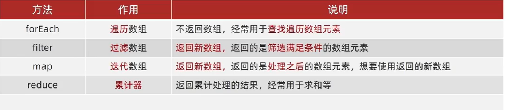

# 作用域

## 作用域链

```
作用域链本质上是底层的变量查找机制
1.在函数被执行时，会优先查找当前函数作用域中查找变量
2.如果当前作用域查找不到则会依次逐级查找父级作用域，直到全局作用域
```

## 垃圾作用回收机制

```js
生命周期
1.内存分配
2.内存使用
3.内存回收
说明:
	全局变量一般不会回收
    一般情况下局部变量的值，不用了，会被自动回收掉
    
内存泄漏:程序中分配的内存由于某种原因程序未释放，或无法释放叫做内存泄漏
通过null来释放

//垃圾回收机制
1.引用计数
缺点:嵌套引用
如果两个对象相互引用，尽管他们已不再使用，垃圾回收器不会进行回收导致内存泄漏,例如:
function fn(){
    let o1={}
    let o2={}
    o1.a=o2
    o2.a=o1
    return '计数器无法回收'
}
因为他们技术无法永远为0
2.标记清除法
标记清除法将"不再使用的对象"定义为'无法达到的对象'
就是从根部(js中就是全局变量),出发定时扫描内存中的对象，凡是能从根部到达的都是需要使用的
那些无法到达的对象会被标记不再使用稍后进行回收
```

## 闭包

```js
闭包=内层函数+外层函数的变量
会有内存泄漏
例如:
        // 外部可以访问使用函数内部的变量
        function funout() {
            let a = 10
            function fn() {
                console.log(a)
            }
            return fn
        }
        // funout() === fn === function fn() { }
        let tim = funout()
        tim()
```

## 变量提升

```js
//当代码执行之前会把所有var定义的变量提到最前面
//只提升声明，不提升赋值
```

# 函数进阶

```
函数用var fun=function(){
	...
}定义时声明必须在使用前面，var声明时，会提前，会出现只声明名字，没有内容，所以会报错
```

## 动态参数

```js
//在参数不确定有几个的时候进行动态参数的使用
arguments是函数内部内置的伪数组变量，它包含了调用函数时传入的所有实参
```

## 剩余参数

```js
//剩余参数允许我们将一个不定数量的参数表示为一个数组
function getSum(a,b,...arr){
    //arr为数组
    //有第一个参数给a
    //有第二个参数给b 
    //剩余的参数给arr数组
}

///展开运算符
写在函数外面的...是展开运算符
用于求最大值的方法Math.max(...arr)
合并数组arr=[...arr1,...arr2]
```

## 箭头函数

```js
箭头函数更适合用于那些本来需要匿名函数的地方
const fn=()=>{
	...
}
当参数只有一个的时候可以不要括号
const fn=x=>{
    ...
}
当只有一个参数和一行代码时可以简写
const fn=x=>x*x	//不用return也可以返回

可以直接返回一个对象
const fn=uname=>({uanme:uname})//要加一个小括号

箭头函数不会创建自己的"this"，它只会从自己的作用域链的上一层沿用this
```

# 解构赋值

## 数组解构

```js
数组解构是将"数组的单元值"快速"批量"赋值给"一系列变量"的简洁语法
例如
const arr = [100, 200, 300]
const [a, b, c] = arr
console.log(a)
console.log(b)
console.log(c) 
//交换两个变量
let a = 1
let b = 2;	//注意一定要加个分号，在数组解构的时候一定要加个分号，使用数组的时候也得用分号
[a, b] = [b, a]
console.log(a, b)

//当单元值多变量少时，多的变量为undefined
防止undefined出现
const [a=0,b=0]=[]
const [a,b, ,d]=[1,2,3,4]//a=1,b=2,d=4
const [a,b,[c,d]]=[1,2,[3,4]]

//当变量少单元值多时，可以用剩余参数的方法来执行...arr来接受
```

## 对象结构

```
对象解构是将对象属性和方法快速批量赋值给一系列变量的简洁语法
基本语法
1.赋值运算符 =左侧的{}用于批量声明变量，右侧对象的属性值将被赋值给左侧的变量
2.对象属性的值将被赋值给与属性名相同的变量
3.注意解构的变量名不要和外面的变量名冲突否则报错
4.对象中找不到与变量名一致的属性时变量值为 undefined
```

# 数组方法

## 筛选数组

```
filter()创建一个新数组，新数组中的元素是通过检查指定数组中符合条件的所有元素
主要使用场景:筛选数组符合条件的元素，并返回筛选之后元素的新数组
const newArr=arr.filter(function(item,index){
	return 筛选条件
})
item必写，index<索引>可选
返回新数组，不会影响原数组
```

# 构造函数

```js
目的:创建对象
使用场景:快速创建多个类似的对象
约定：
1.首字母大写
2.只能通过"new"操作符来创建


实列成员:
写在实列身上，互相分开
静态成员:
构造函数的属性和方法被称为静态成员(静态方法)
例如:
function Pig(name){
    this.name=name
}
Pig.eyes=2
Pig.sayHi=function(){
    console.log(this)
}
Pig.sayHi()
console.log(Pig.eyes)
```

## 内置构造函数

```
字符串，数值，布尔，等基本类型也都有专门的构造函数，这些我们称为包装类型，JS中几乎所有的数据都可以基于构造函数创建
```

### Object

```js
静态方法:
Object.keys(o)	//获取全部属性名，返回数组
Object.values(o)	//获取全部属性值，返回数组
Object.assign(新对象,待拷贝对象)	//拷贝对象
```

### Array

```js
new Array常用于创造数组
const arr=new Array()
```

核心方法



```
reduce返回累积处理的结果
基本语法
arr.reduce(function(){},起始值)
arr.reduce(function(上一次值<prev>,当前值<current>){},起始值)
```

 

```js
///find
const inventor = [
	{ name: 'gkh', quantity: 2 },
	{ name: 'gh', quantity: 2 },
	{ name: 'gk', quantity: 2 },
        ]
console.log(inventor.find((furst) => { return furst.name === 'gkh' }))

//标签选取时用的是伪数组

```

### String


```js
//splict将字符串分割为数组
const str = "pink,gkh"
const arr = str.split(',')
console.log(arr)

//字符串截取,左开右闭
const str = "pink,gkh"
console.log(str.substring(1, 5))// ink,

//以字符串开头,返回true，或者flase
const str = "pink,gkh"
console.log(str.startsWith('pink'))//true

//includes,查看一个字符串是否包含在另一个字符串中，返回true，或者flase
const str = "pink,gkh"
console.log(str.includes('gkh'))//true


```

### Number

```js
Number是内置的构造函数，用于创建数值
常用方法:
toFixed()设置保留小数的长度
const num = 10.925
console.log(num.toFixed(2))
```

# 深浅拷贝

## 浅拷贝

浅拷贝的是地址不是类型，当对象中出现对象时，无法实现拷贝

```js
"方法一"
const obj={

}
const o=obj
"方法二"
//改变某一值不影响obj
const obj={

}
const o
Object.assign(o,obj)
"方法三"
//改变某一值不影响obj
const obj={

}
const o={...obj}
```

## 深拷贝

首先浅拷贝和深拷贝只针对引用类型

深拷贝：拷贝的是对象，不是地址

```js
常见方法
1.通过递归实现深拷贝
2.lodash/cloneDeep
3.通过JSON.stringify()实现
```

### 递归深拷贝

```js
const obj = {
	name: 'gkh',
	age: 20,
	hobby: ['乒乓球', '足球 ']
}
const o = {}
        function deepCopy(newObj, oldObj) {
            for (let k in oldObj) {
                //处理数组问题
                if (oldObj[k] instanceof Array) {
                    newObj[k] = []
                    //newObj[k]接受[]
                    deepCopy(newObj[k], oldObj[k])
                    //处理对象里面的对象
                } else if (oldObj[k] instanceof Object) {
                    newObj[k] = {}
                    deepCopy(newObj[k], oldObj[k])
                }
                else {
                    newObj[k] = oldObj[k]
                }
            }
        }
        deepCopy(o, obj)
```

### lodash里面cloneDeep内部实现深拷贝

通过**Lodash**官网获取
https://github.com/lodash/lodash

```js
//通过引入库来调用方法
 <script src="./lodash.js"></script>
    <script>
        const obj = {
            name: 'gkh',
            age: 18,
            hobby: ['乒乓球', '足球'],
            family: {
                baby: '小gkh'
            }
        }
        const o = _.cloneDeep(obj)
        o.family.baby = "lao"
        console.log(o)
        console.log(obj)
    </script>
```

### 通过JSON.stringify()实现

```js
//将对象转化成字符串,再转化成对象
const o=JSON.parse(JSON.stringify(obj))
```

# 异常处理

## throw抛异常

```js
function fn(x, y) {
            if (!x || !y) {
                throw new Error('没有cand')
            }
            return x + y
        }
        console.log(fn())
```

## try/catch捕获异常

```js
        function fn() {
            try {
                const p = document.querySelector('.p')
                p.style.color = 'red'
            } catch (err) {
                //拦截错误，提示浏览器提供的错误信息，但是不中断程序执行
                console.log(err.message)
                // 搭配throw使用
                throw new Error('错误')//会中断异常，不用return了
                //需要加return中断程序
                // return

            }
            finally {
                //不管代码对不对，一定会执行的代码
                alert('弹出对话框')
            }
            console.log(11)
        }
        fn()
```

## debugger

```js

```

# this指向

'use strict'	开启严格this指向

函数也不能一样

```
普通函数中，this指向调用者
箭头this中，绑定最近一级的this
	原型对象中不推荐使用this
```

## 改变this指向

```js
call()
使用call方法调用函数，同时指定被调用函数中this的值
语法:
fun.call(thisArg,arg1,arg2,...)
例:
const obj = {
            uname: 'pink'
        }
        function fn(x, y) {
            console.log(this)
            console.log(x + y)
        }
        fn.call(obj, 3, 5)
```

apply

```js
改变函数this指向，第二个参数必须为数组，列如
        const obj = {
            uname: 'pink'
        }
        function fn(x, y) {
            console.log(this)
            console.log(x + y)
        }
		fn.apply(obj, [3, 4])

//使用场景，求数组最大值
```

bind

```js
bind()方法不会调用函数，但是能改变函数内部this指向
语法:
fun.bind(thisArg,arg1,arg2,...)
const fun=fn.bind(obj)//返回的是一个函数里面的this被更改为obj
```

# 防抖

单位时间内，频繁触发事件，只执行最后一次

## lodash方法

```js
//lodash库提供防抖库
<script src="./拷贝/lodash.js"></script>
    <script>
        const box = document.querySelector('.box')
        let i = 1
        function mouse() {
            box.innerHTML = i++
        }
        box.addEventListener('mousemove', _.debounce(mouse, 500))
    </script>
```

## 手写方法

```js
核心思路:
防抖的核心就是利用定时器(setTimeout)来实现
1.先声明一个定时器变量
2.当鼠标每次滑动都先判断是否有定时器了，如果有就先清除以前的定时器
3.如果没有定时器则开启定时器，记得存到变量面
4.在定时器里面调用执行的函数
```

```js
        const box = document.querySelector('.box')
        let i = 0
        function mouse() {
            box.innerHTML = ++i
        }
        function debounce(fn, t) {
            let timer
            console.log(11)
            return function () {
                if (timer) clearTimeout(timer)
                timer = setTimeout(function () {
                    fn()
                }, t)
            }
        }
        box.addEventListener('mousemove',debounce(mouse, 500))

```

# 节流

单位时间内，频繁触发事件，只执行一次

## lodash

```js
 const box = document.querySelector('.box')
        let i = 1
        function mouse() {
            box.innerHTML = i++
        }
        box.addEventListener('mousemove', _.throttle(mouse, 3000))

```

## 手写法

```
防抖的核心就是利用定时器(setTimeout)来实现
1.先声明一个定时器变量
2.当鼠标每次滑动都先判断是否有定时器了，如果有就先清除以前的定时器
3.如果没有定时器则开启定时器，记得存到变量面
定时器里面调用执行的函数
定时器里面要把定时器清空
```

